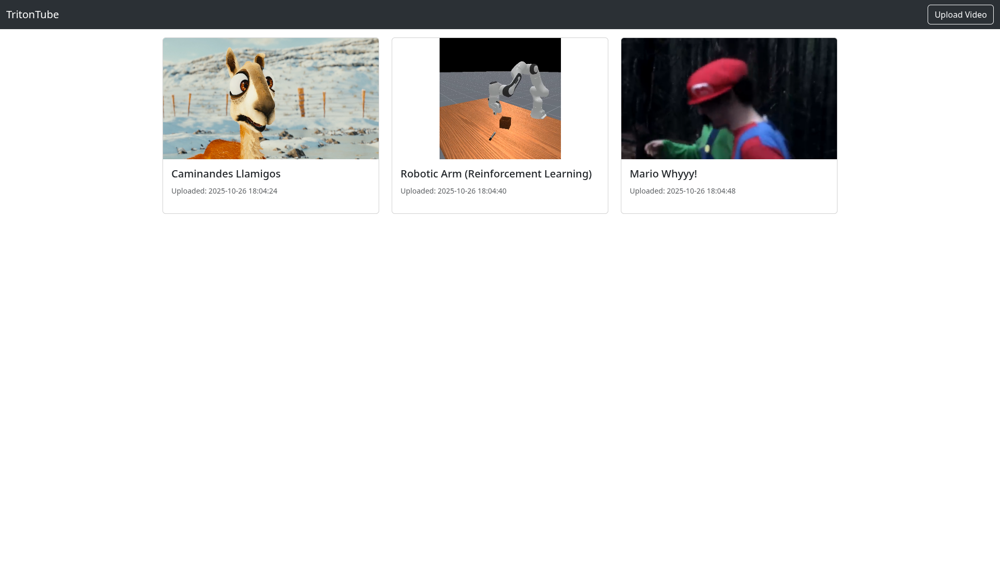
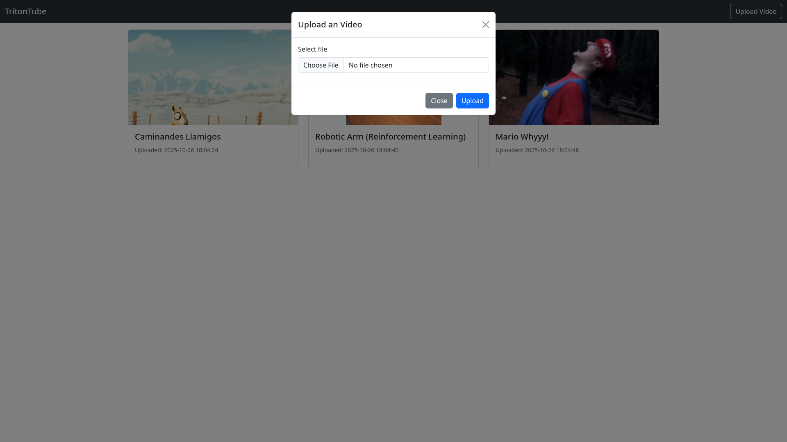
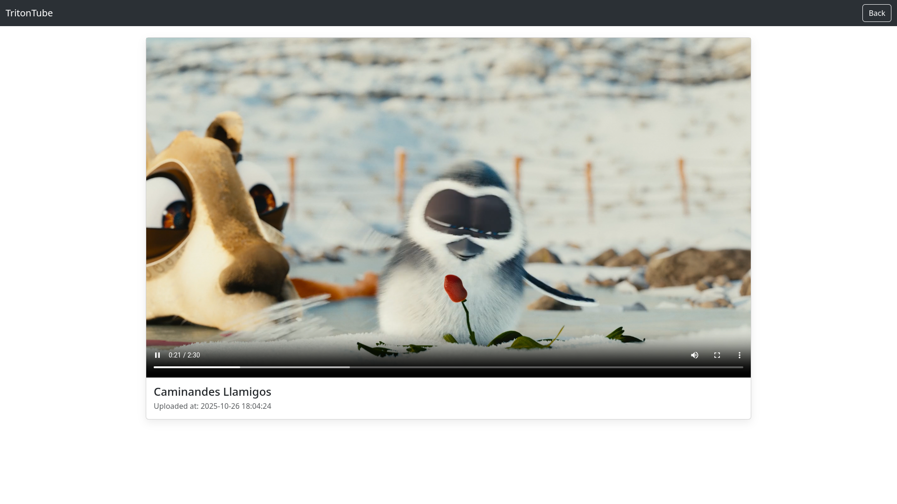

# TritonTube

TritonTube is a distributed video streaming website that allows users to upload and watch videos with MPEG-DASH playback. This project showcases a scalable distributed architecture for video storage and streaming, utilizing gRPC for communication between the web server and storage nodes. Uploaded videos in MP4 format are converted to MPEG-DASH using FFmpeg, enabling adaptive bitrate streaming for an optimal viewing experience.

## Tech Stack

- **Go**: The primary programming language for the backend services.
- **gRPC**: Used for communication between the web server and the distributed storage nodes.
- **Protocol Buffers**: For defining the service contracts for our gRPC services.
- **MPEG-DASH**: The video streaming protocol used for adaptive bitrate streaming.
- **FFmpeg**: A command-line tool to convert uploaded MP4 videos into the MPEG-DASH format.
- **SQLite**: As the metadata storage for video information.
- **Consistent Hashing**: To distribute video content evenly across storage servers and ensure scalability.
- **Bootstrap**: For front-end styling and responsive design.

## Screenshots

<div style="display: flex; justify-content: space-around; flex-wrap: wrap;">
  
  
  
</div>

## Deployment

This application has been successfully tested on **Amazon Web Services (AWS)**, demonstrating its capability to run in a cloud environment. The web and storage servers were deployed on separate EC2 instances to validate the distributed architecture.

## Dependencies

- Go 1.24.1 or later
- FFmpeg

## Setup

1.  **Clone the repository:**

    ```bash
    git clone https://github.com/ModernOctave/TritonTube.git
    cd tritontube
    ```

2.  **Install dependencies:**

    ```bash
    go mod tidy
    ```

3.  **Compile protocol buffers:**

    ```bash
    make proto
    ```

## Usage

The system consists of three main components: the **web server**, **storage servers**, and an **admin command-line interface (CLI)**.

1.  **Start the storage servers:**

    Start up as many storage servers as you like using the following command:

    ```bash
    go run ./cmd/storage/main.go -port <PORT> -host <HOST> <STORAGE_PATH>
    ```

    HOST & PORT specify where the storage server will be running, and STORAGE_PATH is the directory where the server will store video files.

2.  **Start the web server:**

    Now that the storage servers are running, start the web server with the following command:

    ```bash
    go run ./cmd/web/main.go -port 8080 -host localhost sqlite "./metadata.db" nw "<HOST1>:<PORT1>,<HOST2>:<PORT2>,...,<HOSTN>:<PORTN>"
    ```

    Replace `<HOST1>:<PORT1>,<HOST2>:<PORT2>,...,<HOSTN>:<PORTN>` with a comma-separated list of the storage server addresses you started in the previous step.

3.  **Admin CLI:**

    The admin CLI allows you to manage the storage nodes in the cluster after starting the web server.

    - **List nodes**:

        List all storage nodes currently in the cluster:

        ```bash
        go run ./cmd/admin/main.go list <WEB_SERVER_HOST>:<WEB_SERVER_PORT>
        ```

    - **Add a node**:

        Add a new storage node to the cluster and redistribute content (using consistent hashing):

        ```bash
        go run ./cmd/admin/main.go add <WEB_SERVER_HOST>:<WEB_SERVER_PORT> <NEW_NODE_HOST>:<NEW_NODE_PORT>
        ```

    - **Remove a node**:

        Remove a storage node from the cluster and redistribute content:

        ```bash
        go run ./cmd/admin/main.go remove <WEB_SERVER_HOST>:<WEB_SERVER_PORT> <NODE_HOST>:<NODE_PORT>
        ```